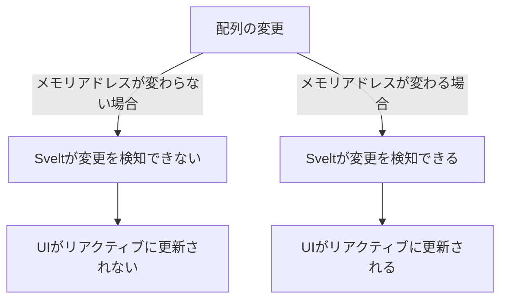

# Svelte TypeScript Multiple Counter App

このプロジェクトは、SvelteフレームワークとTypeScriptを使用して、複数のカウンターを機能を実装しました。

## コーディングルール

- **言語:** TypeScript
- **フレームワーク:** Svelte
- **インデント:** 半角スペース2個分

## システム要件

- **カウンター機能:**
  - カウントの増減機能
  - カウントのリセット機能
- **カウンター管理:**
  - カウンターの追加および削除機能
  - 各カウンターのタイトル設定機能
  - 複数のカウンターの合計値表示機能

## 工夫した点

- **パフォーマンス:** Svelteのリアクティブ機能を活用し、UIのリアルタイム更新を可能にしました。
- **Felteライブラリ:** フォームライブラリのFelteを使用することで、フォームの追加、削除等を少ないコード量で実装できました。

## 難しかった点

- **デプロイ:** AWS Amplifyにデプロイ時に「ページが見つかりません」というエラーが発生した点。この問題は、「adapter-static」プラグインを導入し、svelte.config.jsファイルに適切なadapterの設定を、amplify.ymlにビルドファイルのパスを正しく設定することで解決した。

- **リアクティブの考え方(配列)：** 配列の状態管理はメモリアドレスを参照しており、このメモリアドレスが変更された場合にリアクティブにUIを更新できる。
この考え方や配列操作時のメモリアドレスの仕組みの理解が難しく感じました。
追加するフォームの初期値を`0`に設定するときに、この考えを理解できておらず、push操作で行ってしまったため、UIが更新されずに苦労しました。
初期値を`0`に設定する場合、
 - `count.push(0)`: 配列内の要素は変更されるが、配列のメモリアドレス自体は変更されない。そのため、Svelteは変更を検知できず、UIがリアクティブに更新されませんでした。
 - `count = [...count, 0]`: 既存の配列 `count` をコピーし、更に要素 `0` を追加した新しい配列を作成する。新しい配列は異なるメモリアドレスを持つため、Svelteが変更を検知し、UIが正しくリアクティブに更新されました。

